# UML Class Diagram - Java Shapes Project

## Class Hierarchy Diagram

```mermaid
classDiagram
    class Shape {
        <<abstract>>
        -int numberOfDimensions
        +Shape(int numberOfDimensions)
        +getNumberOfDimensions() int
        +getShapeName()* String
    }
    
    class TwoDimensionalShape {
        <<abstract>>
        +TwoDimensionalShape()
        +getArea()* double
        +toString() String
    }
    
    class ThreeDimensionalShape {
        <<abstract>>
        +ThreeDimensionalShape()
        +getVolume()* double
        +toString() String
    }
    
    class Circle {
        -double radius
        +Circle(double radius)
        +getRadius() double
        +getArea() double
        +getShapeName() String
    }
    
    class Rectangle {
        -double length
        -double width
        +Rectangle(double length, double width)
        +getLength() double
        +getWidth() double
        +getArea() double
        +getShapeName() String
    }
    
    class Square {
        -double side
        +Square(double side)
        +getSide() double
        +getArea() double
        +getShapeName() String
    }
    
    class Triangle {
        -double base
        -double height
        +Triangle(double base, double height)
        +getBase() double
        +getHeight() double
        +getArea() double
        +getShapeName() String
    }
    
    class Sphere {
        -double radius
        +Sphere(double radius)
        +getRadius() double
        +getVolume() double
        +getShapeName() String
    }
    
    class Cube {
        -double side
        +Cube(double side)
        +getSide() double
        +getVolume() double
        +getShapeName() String
    }
    
    class Cone {
        -double radius
        -double height
        +Cone(double radius, double height)
        +getRadius() double
        +getHeight() double
        +getVolume() double
        +getShapeName() String
    }
    
    class Cylinder {
        -double radius
        -double height
        +Cylinder(double radius, double height)
        +getRadius() double
        +getHeight() double
        +getVolume() double
        +getShapeName() String
    }
    
    class Torus {
        -double majorRadius
        -double minorRadius
        +Torus(double majorRadius, double minorRadius)
        +getMajorRadius() double
        +getMinorRadius() double
        +getVolume() double
        +getShapeName() String
    }
    
    class ShapeMenu {
        -Scanner scanner
        +ShapeMenu()
        +run() void
        -displayMenu() void
        -getValidMenuChoice() int
        -processShapeConstruction(int choice) void
        -constructCircle() Circle
        -constructRectangle() Rectangle
        -constructSquare() Square
        -constructTriangle() Triangle
        -constructSphere() Sphere
        -constructCube() Cube
        -constructCone() Cone
        -constructCylinder() Cylinder
        -constructTorus() Torus
        -getPositiveDouble(String prompt) double
        -askToContinue() boolean
        -displayExitMessage() void
        +main(String[] args) void
    }
    
    Shape <|-- TwoDimensionalShape : extends
    Shape <|-- ThreeDimensionalShape : extends
    TwoDimensionalShape <|-- Circle : extends
    TwoDimensionalShape <|-- Rectangle : extends
    TwoDimensionalShape <|-- Square : extends
    TwoDimensionalShape <|-- Triangle : extends
    ThreeDimensionalShape <|-- Sphere : extends
    ThreeDimensionalShape <|-- Cube : extends
    ThreeDimensionalShape <|-- Cone : extends
    ThreeDimensionalShape <|-- Cylinder : extends
    ThreeDimensionalShape <|-- Torus : extends
    ShapeMenu ..> Circle : creates
    ShapeMenu ..> Rectangle : creates
    ShapeMenu ..> Square : creates
    ShapeMenu ..> Triangle : creates
    ShapeMenu ..> Sphere : creates
    ShapeMenu ..> Cube : creates
    ShapeMenu ..> Cone : creates
    ShapeMenu ..> Cylinder : creates
    ShapeMenu ..> Torus : creates
```

## Relationship Types

### IS-A Relationships (Inheritance)
- **Shape** is the abstract base class
- **TwoDimensionalShape** IS-A Shape
- **ThreeDimensionalShape** IS-A Shape
- **Circle** IS-A TwoDimensionalShape
- **Rectangle** IS-A TwoDimensionalShape
- **Square** IS-A TwoDimensionalShape
- **Triangle** IS-A TwoDimensionalShape
- **Sphere** IS-A ThreeDimensionalShape
- **Cube** IS-A ThreeDimensionalShape
- **Cone** IS-A ThreeDimensionalShape
- **Cylinder** IS-A ThreeDimensionalShape
- **Torus** IS-A ThreeDimensionalShape

### HAS-A Relationships (Composition)
- **Shape** HAS-A numberOfDimensions (int)
- **TwoDimensionalShape** HAS-A area (calculated property)
- **ThreeDimensionalShape** HAS-A volume (calculated property)
- **Circle** HAS-A radius
- **Rectangle** HAS-A length and width
- **Square** HAS-A side
- **Triangle** HAS-A base and height
- **Sphere** HAS-A radius
- **Cube** HAS-A side
- **Cone** HAS-A radius and height
- **Cylinder** HAS-A radius and height
- **Torus** HAS-A majorRadius and minorRadius
- **ShapeMenu** HAS-A Scanner

## Design Patterns Used

1. **Template Method Pattern**: The abstract classes define the structure while concrete classes provide implementation
2. **Factory Pattern**: ShapeMenu acts as a factory for creating shape objects based on user input
3. **Polymorphism**: All shapes can be referenced through their abstract parent types
