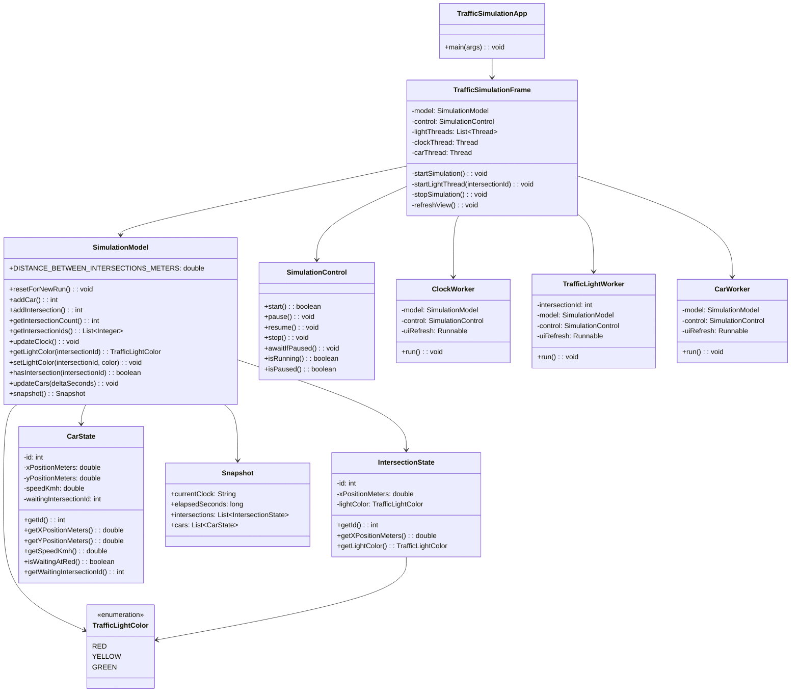

# UML Class Diagram (Mermaid)

```mermaid
classDiagram
    class TrafficSimulationApp {
        +main(args): void
    }

    class TrafficSimulationFrame {
        -model: SimulationModel
        -control: SimulationControl
        -lightThreads: List~Thread~
        -clockThread: Thread
        -carThread: Thread
        -startSimulation(): void
        -startLightThread(intersectionId): void
        -stopSimulation(): void
        -refreshView(): void
    }

    class SimulationModel {
        +DISTANCE_BETWEEN_INTERSECTIONS_METERS: double
        +resetForNewRun(): void
        +addCar(): int
        +addIntersection(): int
        +getIntersectionCount(): int
        +getIntersectionIds(): List~Integer~
        +updateClock(): void
        +getLightColor(intersectionId): TrafficLightColor
        +setLightColor(intersectionId, color): void
        +hasIntersection(intersectionId): boolean
        +updateCars(deltaSeconds): void
        +snapshot(): Snapshot
    }

    class SimulationControl {
        +start(): boolean
        +pause(): void
        +resume(): void
        +stop(): void
        +awaitIfPaused(): void
        +isRunning(): boolean
        +isPaused(): boolean
    }

    class ClockWorker {
        -model: SimulationModel
        -control: SimulationControl
        -uiRefresh: Runnable
        +run(): void
    }

    class TrafficLightWorker {
        -intersectionId: int
        -model: SimulationModel
        -control: SimulationControl
        -uiRefresh: Runnable
        +run(): void
    }

    class CarWorker {
        -model: SimulationModel
        -control: SimulationControl
        -uiRefresh: Runnable
        +run(): void
    }

    class IntersectionState {
        -id: int
        -xPositionMeters: double
        -lightColor: TrafficLightColor
        +getId(): int
        +getXPositionMeters(): double
        +getLightColor(): TrafficLightColor
    }

    class CarState {
        -id: int
        -xPositionMeters: double
        -yPositionMeters: double
        -speedKmh: double
        -waitingIntersectionId: int
        +getId(): int
        +getXPositionMeters(): double
        +getYPositionMeters(): double
        +getSpeedKmh(): double
        +isWaitingAtRed(): boolean
        +getWaitingIntersectionId(): int
    }

    class Snapshot {
        +currentClock: String
        +elapsedSeconds: long
        +intersections: List~IntersectionState~
        +cars: List~CarState~
    }

    class TrafficLightColor {
        <<enumeration>>
        RED
        YELLOW
        GREEN
    }

    TrafficSimulationApp --> TrafficSimulationFrame
    TrafficSimulationFrame --> SimulationModel
    TrafficSimulationFrame --> SimulationControl
    TrafficSimulationFrame --> ClockWorker
    TrafficSimulationFrame --> TrafficLightWorker
    TrafficSimulationFrame --> CarWorker
    SimulationModel --> IntersectionState
    SimulationModel --> CarState
    SimulationModel --> Snapshot
    SimulationModel --> TrafficLightColor
    IntersectionState --> TrafficLightColor
```
